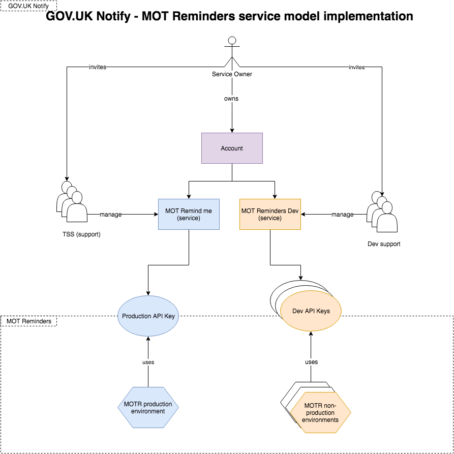
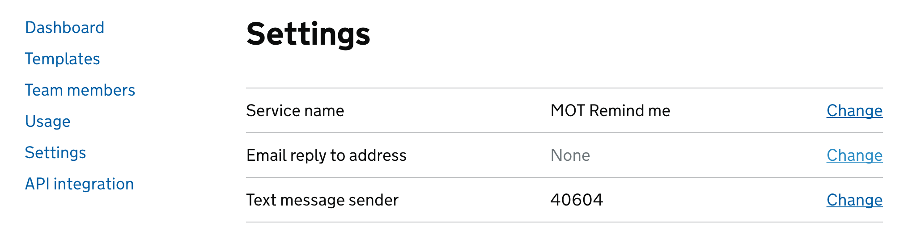
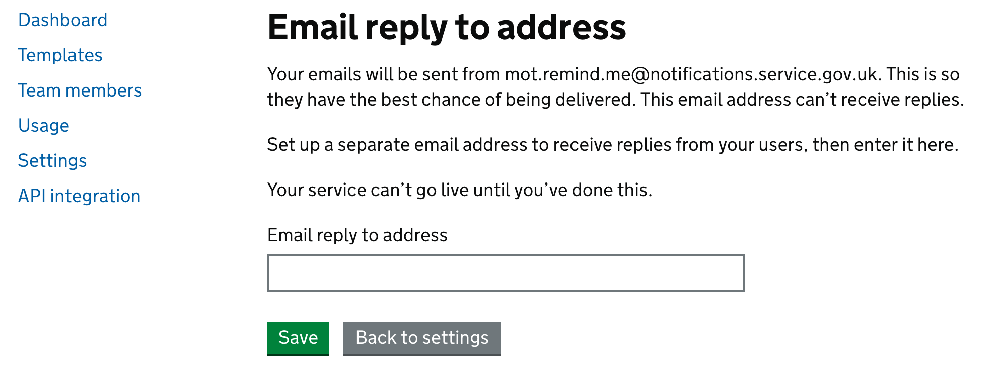
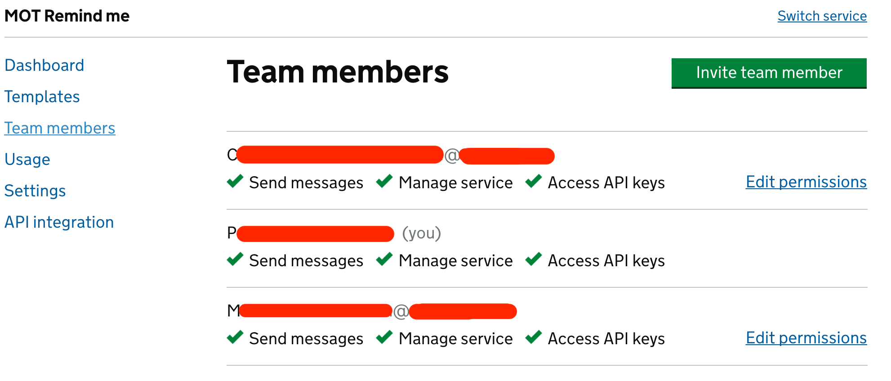
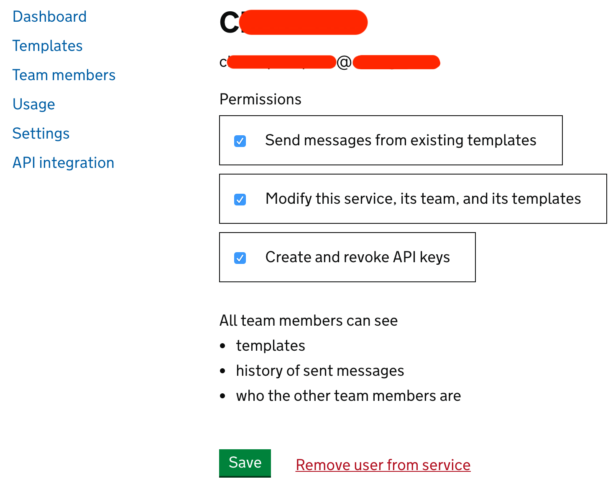
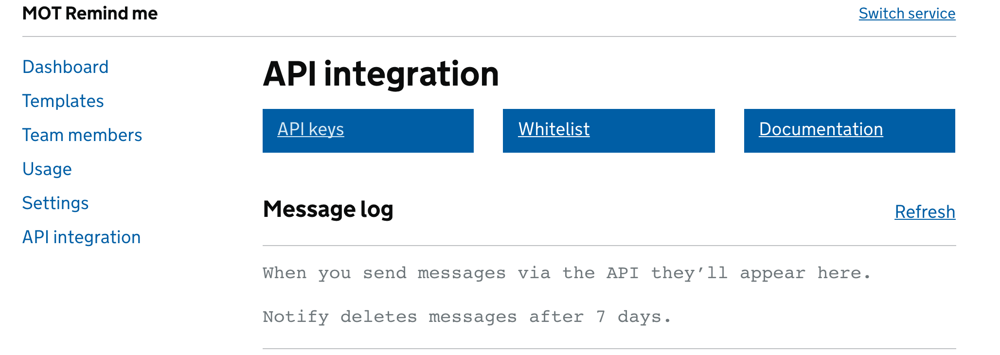
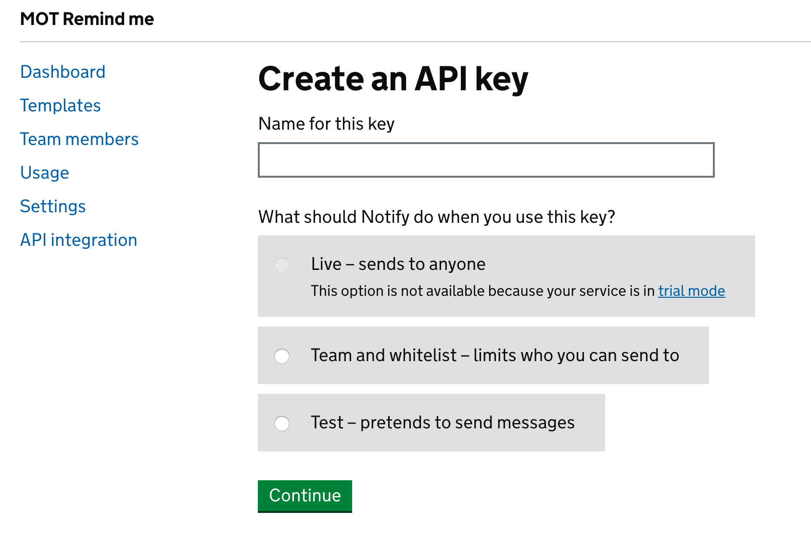

# MOT Reminders will integrate with GovNotify for sending email notifications to subscribers.

## Implementation

1. Service owner will create an account in GovNotify. Each account has to be associated with at least one person that has a mobile phone to authenticate using 2FA.
1. Service owner creates two services: FOR_PRODUCTION_PURPOSE (here: "MOT Remind me") and FOR_DEVELOPMENT_PURPOSE (here: "MOT Reminders Dev").  The name of the service can be modified any time. 
1. Important: Name of the service is used as a sender name for the email sent out on behalf of the service.
1. Service owner delegates management (user management, configuration management) of those services to the appropriate parties by adding their representatives to the Service Team (team which has permission to manage teh service).
1. MOT Reminders Dev is the service which is to support development process - it will contain templates for each environment (eg. dev, pre-prod etc).
1. Email templates will be defined per environment (apart from environments used for development purpose) using convention {template_name}_{env_id}. This will allow to avoid collisions and promote changes to the templates as it happens in the code pipeline.

## Pointing MOT Reminders to Gov.UK Notify
MOT reminders service uses client library of Gov.UK Notify and therefore already correctly points to the right URI. To integrate with right service level a proper API Key has to be generated in Gov.UK Notify and installed in the MOT Reminders configuration in the encrypted form (encrypted to protect secrets and follow best practises)

## Delivering changes to templates through delivery pipeline
Gov.UK Notify does not have built-in mechanism for pipelining changes to templates therefore a separate set of templates should be created for each environment.
When a change is required, it has to go through all deployment stages and applied appropriately.

## Managing MOT Reminders service in Gov.UK Notify
1. Setting up Reply-To email address for the service so that replies will not be bounced.
1. Adding / removing / changing permissions of the team members
1. Managing API keys (Generation/Revocation)

## Setting Reply-To email address
1. Click **Settings**

1. Click Change on Email reply to address

1. Set the target email and click Save

## Managing users
New team members can be invited to the service as well as they can be removed.

Permissions allow to:

## Managing API keys
1. Click API integration 

1. Click API keys

1. Generate new or revoke existing key. Remember once they are generated, they cannot be viewed again. If the key is compromised or lost, it must be revoked and created from replaced.

1. There are 3 kinds of key:
* Live are meant only for production use! 
* Team and Whitelist allows to send emails to everyone in a team plus addresses listed on a whitelist (Please see step 2). The limitation is though you cannot send more than 50 emails per day per service (NOT just using that key).
* Test - they can be used for integration testing. They act as normal keys (API responds as with Live) but they do not result in real messages.
 

 
